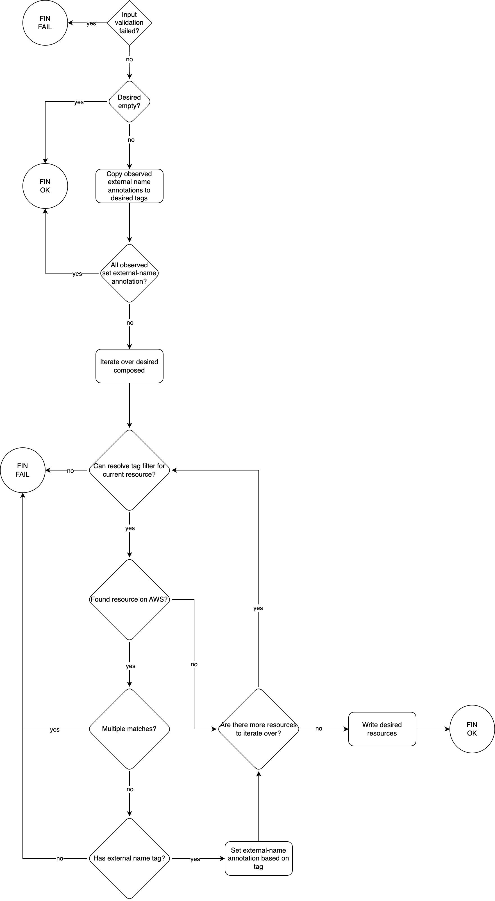

# function-aws-importer flow

The function, in summary, takes the value found in the "crossplane.io/external-name" annotation from observed composed resources
and patches the `.spec.forProvider.tags` field in the respective desired composed resources, when supported.

If the observed composed resource has no "crossplane.io/external-name" annotation, the function attempts fetching the existing
resource in AWS, using tags that Upjet injects into all resources, namely "crossplane-kind" and "crossplane-name".

If it finds a match, it attempts finding the "crossplane-external-name" tag, which would have been inserted by the function
previously if the resource was already managed by a composition using this function. The value from this tag is then
written to the desired composed resource's "crossplane.io/external-name" annotation, ensuring it's imported by the provider.

However, if it finds two or more resources with the same "crossplane-kind" and "crossplane-name" tags, the function fails,
as it's unable to determine which resource to import.

If it finds a resource matching these two tags, but no "crossplane-external-name" is present, or it's empty, the function
also fails, as it's assumed to be at an inconsistent state, and allowing things to move forward could lead to the composed
resource being duplicated at AWS.

The description above delves into the most common paths the function takes, while the flow diagram below also covers less
common edge cases.

